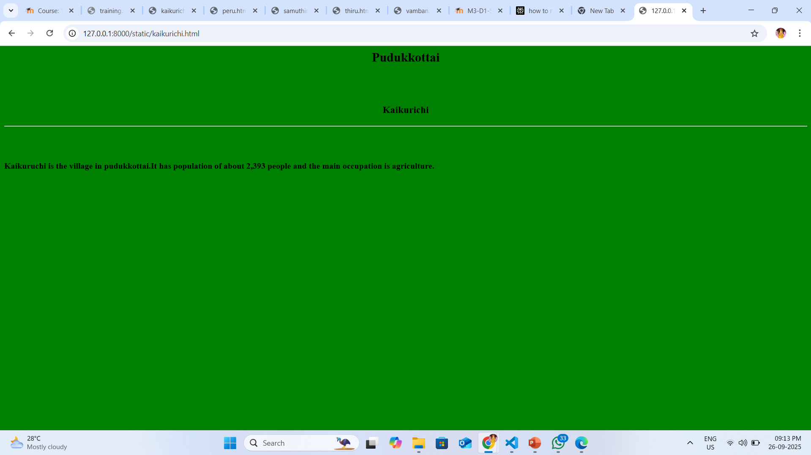

# Ex04 Places Around Me
## Date: 26.09.2025

## AIM
To develop a website to display details about the places around my house.

## DESIGN STEPS

### STEP 1
Create a Django admin interface.

### STEP 2
Download your city map from Google.

### STEP 3
Using ```<map>``` tag name the map.

### STEP 4
Create clickable regions in the image using ```<area>``` tag.

### STEP 5
Write HTML programs for all the regions identified.

### STEP 6
Execute the programs and publish them.

## CODE
```
map.html

<html>
    <head>
        <title>
           sample page 
           <link rel="stylesheet" href="style.css">
        </title>
        
    </head>
    <body>
        <h1 align="center">Pudukkottai</h1>
        <h3 align="center">Kervin.S (25012113)</h3>
        

<map name="image-map">
    <area target="" alt="kaikurichi" title="kaikurichi" href="kaikurichi.html" coords="933,523,1076,583" shape="rect">
    <area target="" alt="vamban" title="vamban" href="vamban.html" coords="1516,482,47" shape="circle">
    <area target="" alt="thiruvarangulam" title="thiruvarangulam" href="thiru.html" coords="1194,384,1284,384,1339,442,1292,486,1194,482,1149,440" shape="poly">
    <area target="" alt="perungudi" title="perungudi" href="peru.html" coords="835,760,63" shape="circle">
    <area target="" alt="namanasamuthiram" title="namanasamuthiram" href="samuthiram.html" coords="535,700,735,767" shape="rect">
</map>
    </body>
</html>

kaikurichi.html

<html>
    <head>

    </head>
    <body bgcolor="green">
        <h2 align="center">Pudukkottai</h2>
        <br><br>
        <h3 align="center">Kaikurichi</h3>
        <hr>
        <br><br>
        <h4>Kaikuruchi is the village in pudukkottai.It has population of about 2,393 people and the main occupation is agriculture.</h4>

    </body>
</html>

vamban.html

<html>
    <head>

    </head>
    <body bgcolor="blue">
        <h2 align="center">Pudukkottai</h2>
        <br><br>
        <h3 align="center">Vamban</h3>
        <hr>
        <br><br>
        <h4>Vamban is the village in Thiruvarangulam Block in pudukkottai.It is well known for National Pulses Reasearch Center which supports farmer for cultivation.</h4>

    </body>
</html>

thiru.html

<html>
    <head>

    </head>
    <body bgcolor="yellow">
        <h2 align="center">Pudukkottai</h2>
        <br><br>
        <h3 align="center">Thiruvarangulam</h3>
        <hr>
        <br><br>
        <h4>Thiruvarangulam is the villlage  in the Alangudi Taluka in Pudukkottai.It has about 82% literacy rate.</h4>

    </body>
</html>

peru.html

<html>
    <head>

    </head>
    <body bgcolor="red">
        <h2 align="center">Pudukkottai</h2>
        <br><br>
        <h3 align="center">Perungudi</h3>
        <hr>
        <br><br>
        <h4>Perungudi is the largest village in the Thirumayam Block in Pudukkottai.It hass about 6000+ people.Agriculture is the main occupation.</h4>

    </body>
</html>

samuthiram.html

<html>
    <head>

    </head>
    <body bgcolor="cyan">
        <h2 align="center">Pudukkottai</h2>
        <br><br>
        <h3 align="center">Namanasamuthiram</h3>
        <hr>
        <br><br>
        <h4>Namanasamuthiram is a village in Arimalam Block in Pudukkkottai.the pincode is 622506.The literacy rate here is 71.26%.</h4>

    </body>
</html>
```
## OUTPUT




## RESULT
The program for implementing image maps using HTML is executed successfully.
